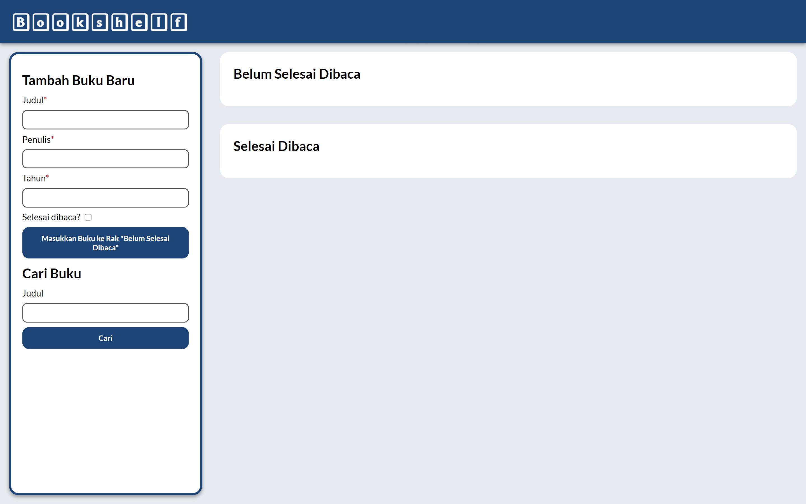

# bookshelf-app 📖
Tugas Akhir Modul Belajar Membuat Frontend Web untuk Pemula FEBE Path Program Asah by Dicoding

## Screenshots

## Features
- Responsive Design
- Hover and Click Interaction
- Add Book
- Delete Book
- Move Book Between Shelves
- Searching Books

## Technology Used
- HTML
- CSS
- JS
